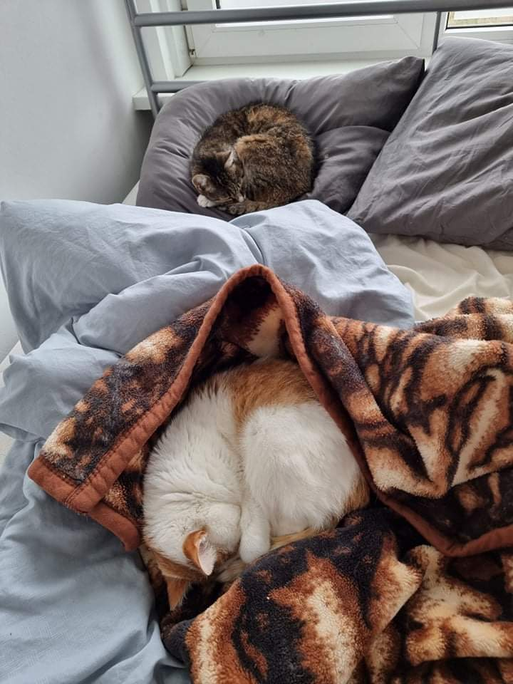

# Why?

I plan to build static site generator that will only display images when you provide password to decrypt them.
This is PoC for that.

# How it works?

I use GPG to encrypt image that later is fetched via `fetch` api of browser and decrypted with
JS implementation of OpenPGP.

# How to preview example?

First I need to encrypt some image with GPG. In this case I'll use photo of my cute cats Charlie and Felicia.

```
gpg --output charlieAndFelicia.gpg --cipher-algo AES256 --symmetric charlieAndFelicia.jpeg
```

When asked about password type `charlieAndFelicia`.

Next you need some `http server` to serve your files. I'm using `http-server` package from `npm`.
You can install it with `npm -i g http-server`.

Setup your server in repo directory.
```
http-server .
```

After that open browser on IP and port provided via HTTP server. If everything works fine you should see
two cats sleeping.




